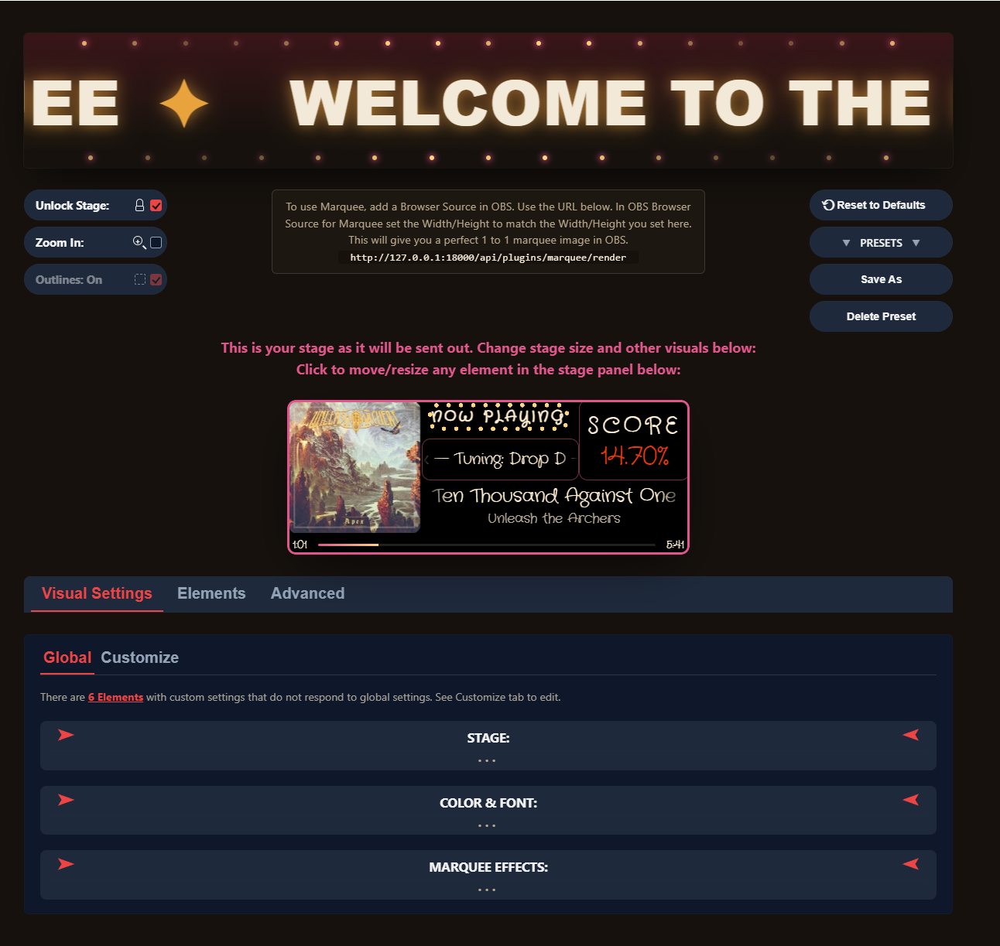

# Marquee

A now-playing overlay plugin for [FeedBack](https://github.com/got-feedBack/feedBack-desktop), designed as an OBS Browser Source. Shows album art, song title/artist, tuning, year, arrangement, live score, and song progress, staying in sync in real time as you play — fully positioned and styled through an in-app visual editor, no CSS editing required.



## Download

**[⬇ Download Marquee.zip (latest release)](https://github.com/MajorMokoto/Marquee/releases/latest/download/Marquee.zip)**

Unzip it, then place the `marquee` folder from inside into your FeedBack `plugins` folder — typically:

```
feedback\current\resources\slopsmith\plugins\
```

Restart FeedBack. Open **Settings → Plugins → Marquee** to lay out and style the overlay.

See [marquee/README.md](marquee/README.md) for full feature details, screenshots, and how it works.

## License

AGPL-3.0-only — see [marquee/LICENSE](marquee/LICENSE).
