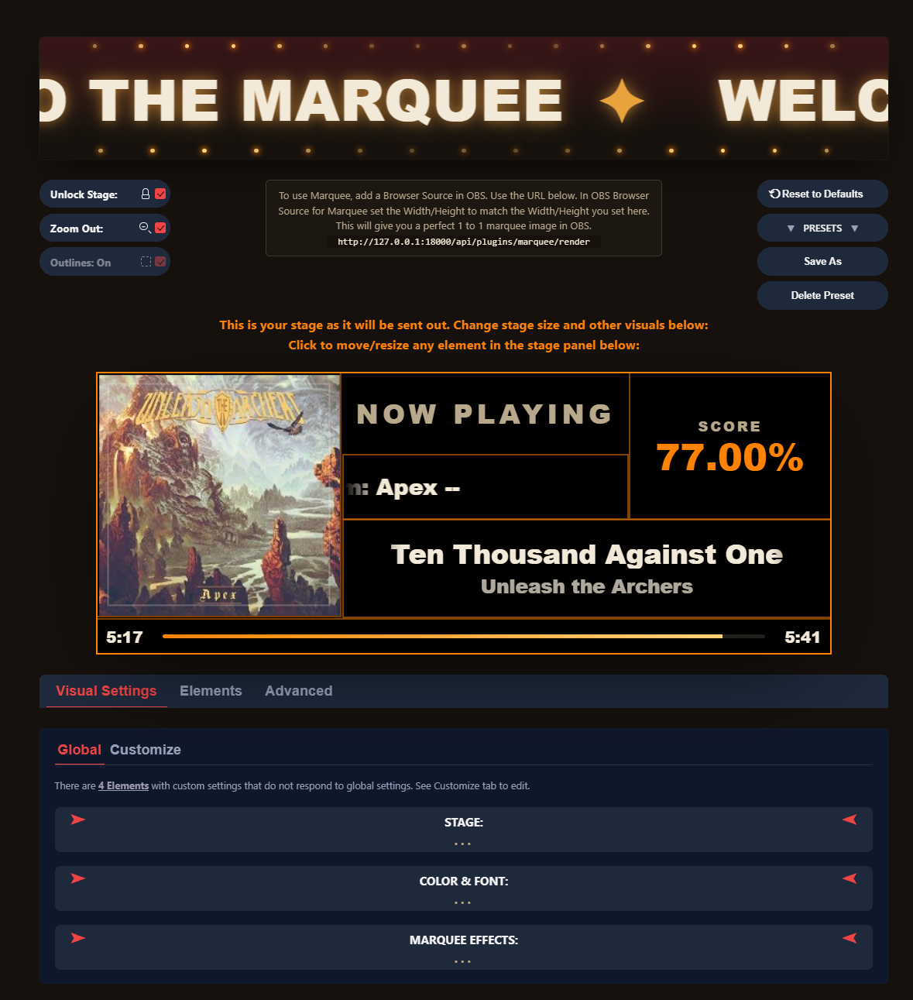
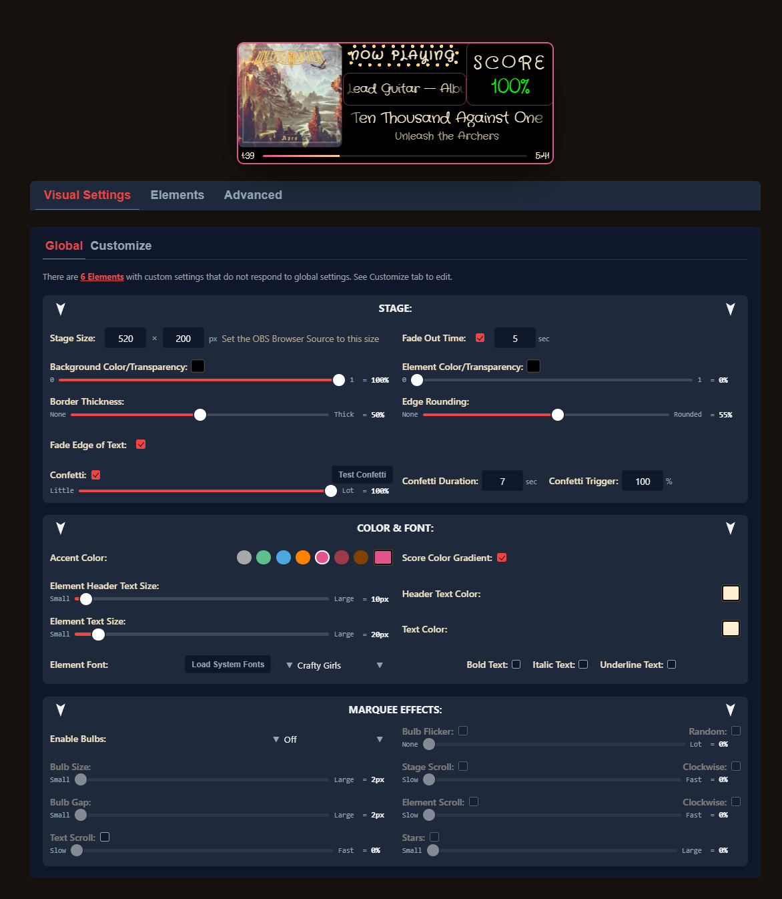
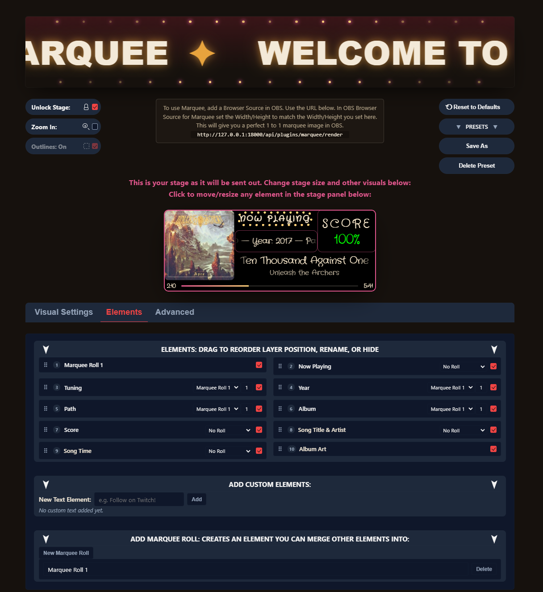
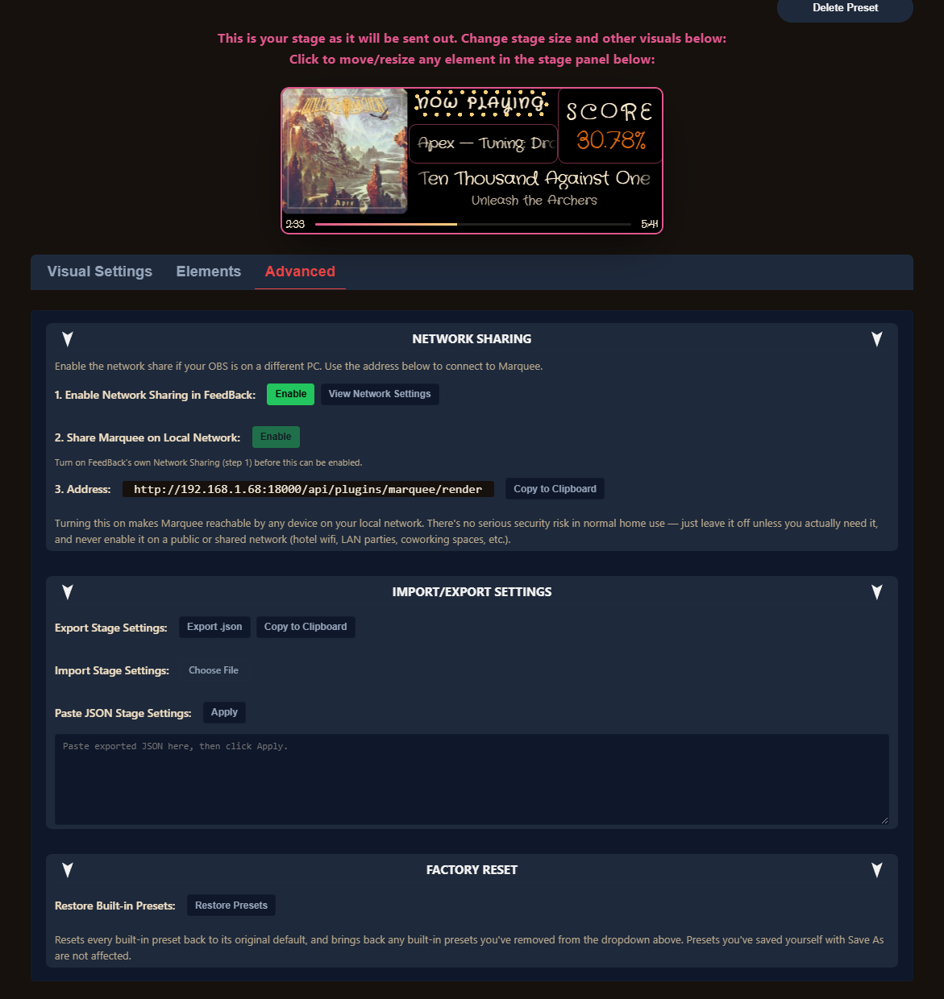
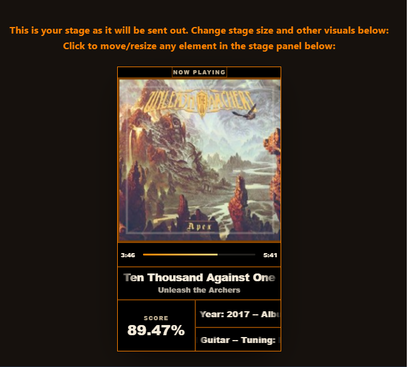
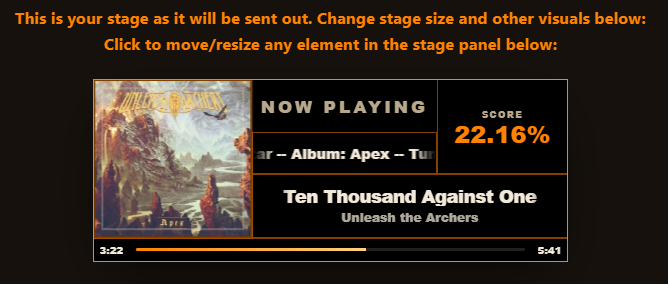

# Marquee

A now-playing overlay plugin for https://github.com/got-feedBack/feedBack-desktop, designed as an OBS Browser Source. It shows album art, song title/artist, tuning, year, arrangement, live score, and song progress, and stays in sync in real time as you play — fully positioned and styled through an in-app visual editor, not hand-edited CSS.

## Screenshots

| | |
|---|---|
|  |  |
|  |  |
|  |  |
|  | |

## Features

- **Live overlay** — song info updates in OBS as you play, pushed over a WebSocket the plugin owns (no polling, no extra process to run).
- **Visual editor** — drag, resize, and reorder every element directly on a live canvas; each element's text automatically centers within whatever box size you give it. Configure:
  - Accent color, element/background color & transparency, border thickness, edge rounding
  - Font (including local system fonts), bold toggle, element header text size
  - Overlay size (px) and fade-out time
  - Custom text elements, added freely alongside the built-in ones
- **Marquee Scroll** — a genuine marquee-sign crawl for Song Title/Artist, Tuning, Path, and Year: text continuously scrolls right to left across the *full width* the element is stretched to, not just far enough to peek past an edge, at an adjustable speed. Song Title & Artist also collapses to one large line ("Artist - Song") instead of two separately-scrolling lines while this is on. Off by default (short/fitting text just sits still, title/artist stay on two lines); toggle it on for the classic scrolling-sign look. Three optional flair toggles layer on top, each independent: **Edge Fade** (fades text at the left/right edges instead of a hard clip), **Stars** (a twinkling cluster of stars, size adjustable in pixels — independent of any element's own font size — in the gap between scrolling repeats), and **Bulbs** (a single continuous ring of scrolling marquee light bulbs traced around an element's whole perimeter — not four independent strips, so the corners flow seamlessly from one edge into the next). Bulbs is a 4-way switch, not a plain on/off: **Off**, **All** (every element plus the layout's own outer border), **Elements Only**, or **Layout Only**. Every element gets the exact same ring regardless of whether it has a ticker — Album Art and Score light up identically to Tuning/Path/Year, independently of the Marquee Scroll toggle — and the layout border gets it too, framing the whole overlay. The layout's own ring is pulled inward from the true canvas edge by one bulb tile's worth of space, so it always reads as its own distinct frame even when an element (like Album Art) is positioned flush against that edge, instead of the two visually merging into one. Bulb size and the gap between bulbs are both independently adjustable — density tracks the gap slider automatically, so the spacing stays consistent at any bulb size. Bulbs has three more settings of its own, each independent: **Bulb Scroll** (on by default — turn off to leave the bulbs static instead of chasing), **Bulb Flicker** (off by default — an old-theater-sign flicker with its own adjustable intensity), and **Bulb Flicker Random** (off by default — when on, every element flickers on its own independent timing instead of in sync with the rest; turning it back off resyncs everyone to a shared clock). All three work whether or not the bulbs are scrolling. **Marquee Roll** merges elements end-to-end into one combined banner instead of several separate tickers: add one with the editor's "Add Marquee Roll" button, then assign any other elements to it (and set their slot order) from their own "Marquee Roll"/"Slot" fields in the Elements list — their headers survive into the merged text (e.g. "Tuning: Drop D ★ ★ ★ Year: 2017"). A Roll is a real, freely positioned/resized element in its own right, and follows every visual setting (Scroll, Stars, Bulbs, and all the rest) exactly like any built-in element.
- **Built-in presets** — Standard, Small, Tall, and User, each with its own layout and visuals, plus three fully hand-tuned showcase presets — **Crafty Girls**, **The Marquee**, and **User Off** — that bake in Marquee Roll and per-element Customize overrides as their actual defaults, not just a starting point. Switch between them, edit freely, and autosave keeps each preset's own state; "Reset to Defaults" restores a preset's original look at any time. A "Refresh Page" button saves the current layout and reloads the editor in one step — useful if something ever looks stuck or out of sync, without losing unsaved edits.
- **Network sharing** — an Advanced tab lets FeedBack and OBS run on two different PCs on the same local network: turn on FeedBack's own Network Sharing plus Marquee's own share toggle, then point OBS's Browser Source at the address shown there instead of `localhost`. Off by default on both toggles; only reachable from other devices once both are explicitly turned on.
- **Confetti** — a configurable particle burst (corner cannons + falling rain) that fires automatically when a song ends with a score at or above a set threshold. Duration, amount, and trigger threshold are all adjustable; a "Test Confetti" button previews it instantly, both in the editor and on the live OBS output.
- **Live preview while editing** — the OBS output shows placeholder content while the editor is open and no song is playing, so you can position everything without needing a real song running.
- **Score** — reads live accuracy from FeedBack's Note Detection plugin when it's installed and enabled; the element simply stays blank otherwise, not an error state.
- **Import/export** — copy or download the current layout as JSON, or paste/upload one back in.
- **Settings panel** — shows the OBS Browser Source URL (one click to copy), current canvas size, and whether the overlay is currently receiving live data.

## Install

Copy this folder into FeedBack's `plugins/` directory (as `plugins/marquee/`) and restart FeedBack (plugins are only discovered at startup — there's no hot-reload). Then, in FeedBack:

1. Open **Marquee** from the Plugins page (or the button in its Settings panel) to lay out and style the overlay.
2. Copy the render URL shown there into an OBS **Browser Source**, matching its Width/Height to what's set in the editor for a pixel-perfect fit.

For plugin development without touching a real FeedBack install, FeedBack supports pointing it at an external folder via the `FEEDBACK_PLUGINS_DIR` environment variable — though on a packaged desktop build, that env var may not reach the app's Python backend regardless of how it's set before launch. If you hit that, drop the plugin folder directly into the real `plugins/` directory instead.

## How it works

`screen.js` runs inside FeedBack's own window (the only place that can reach `window.feedBack`) and forwards live song/position/score events to this plugin's own backend (`routes.py`). The backend fans that out to any connected OBS Browser Source over a WebSocket, and separately serves the editor (`assets/editor.html`) and the render page itself (`assets/render.html`) — both fetch and push through that same backend, so an already-open Browser Source updates live as you edit, with no refresh needed.

## Known limitations

- **Score requires FeedBack's separate Note Detection plugin** — without it, no live accuracy data exists to show.
- **"Previous score"** shows the last completed run's accuracy for the exact same song+arrangement, read from FeedBack's own persisted per-arrangement stats (`GET /api/stats/{filename}`) — it's blank until you've played that arrangement at least once before.
- **Year** comes from library metadata (`GET /api/song/{filename}`), not the live song payload — it renders blank if that lookup has nothing for a given track.
- **"Path"** shows the arrangement's name (e.g. "Lead Guitar"), not a filesystem path.

## License

AGPL-3.0-only — see [LICENSE](LICENSE).
